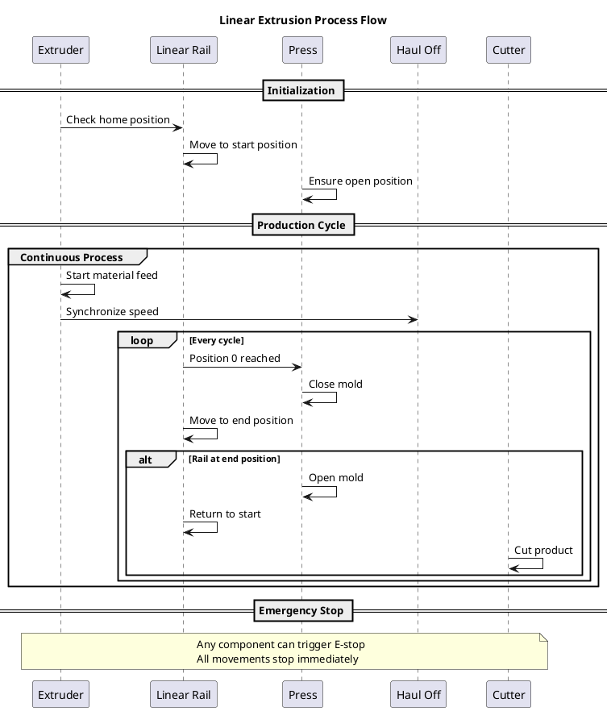

FLOWCHART

## Extrusion Process Flow Diagram

This diagram illustrates the linear extrusion process flow, showing the interaction between:
- Extruder
- Linear Rail System
- Press
- Haul Off
- Cutter

The process includes initialization, continuous production cycle, and emergency stop handling.
