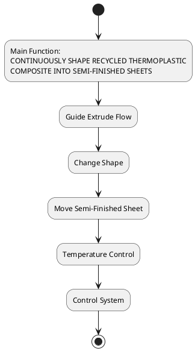
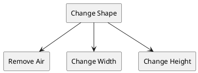
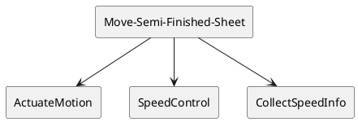
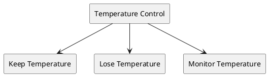
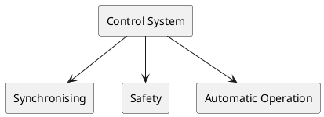

# Analysis of the Process

```plantuml
@startuml
skinparam defaultTextAlignment left

(*) --> "Main Function:
CONTINUOUSLY SHAPE RECYCLED THERMOPLASTIC
COMPOSITE INTO SEMI-FINISHED SHEETS"

--> "Guide Extrude Flow"

--> "Change Shape"

--> "Move Semi-Finished Sheet"

--> "Temperature Control"

--> "Control System"

--> (*)
@enduml

```

CHANGE SHAPE

```plantuml
@startuml

@startuml

RECTANGLE "Change Shape" as ChangeShape
RECTANGLE "Remove Air" as RemoveAir
RECTANGLE "Change Width" as ChangeWidth
RECTANGLE "Change Height" as ChangeHeight

ChangeShape --> RemoveAir
ChangeShape --> ChangeWidth
ChangeShape --> ChangeHeight
@enduml

```

MOVE SEMI FINISHED SHEET

```plantuml
@startuml

RECTANGLE "Move-Semi-Finished-Sheet" as MoveSheet
RECTANGLE ActuateMotion
RECTANGLE SpeedControl
RECTANGLE CollectSpeedInfo

MoveSheet --> ActuateMotion
MoveSheet --> SpeedControl
MoveSheet --> CollectSpeedInfo
@enduml

```

TEMPERATURE CONTROL

```plantuml
@startuml

RECTANGLE "Temperature Control" as TemperatureControl
RECTANGLE "Keep Temperature" as KeepTemperature
RECTANGLE "Lose Temperature" as LoseTemperature
RECTANGLE "Monitor Temperature" as AdjustTemperature

TemperatureControl --> KeepTemperature
TemperatureControl --> LoseTemperature
TemperatureControl --> AdjustTemperature
@enduml
```

CONTROL SYSTEM

``` plantuml
@startuml

RECTANGLE "Control System" as ControlSystem
RECTANGLE "Synchronising" as Synchronising
RECTANGLE "Safety" as Safety
RECTANGLE "Automatic Operation" as AutomaticOperation

ControlSystem --> Synchronising
ControlSystem --> Safety
ControlSystem --> AutomaticOperation
@enduml
```