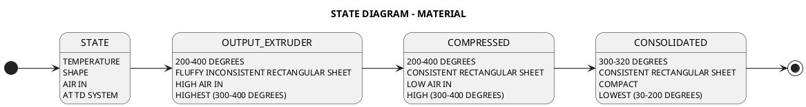
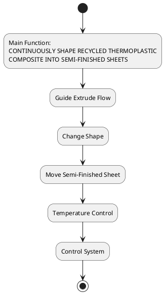
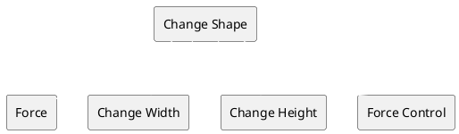
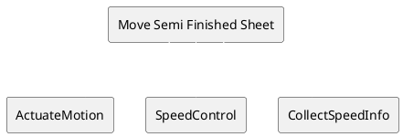
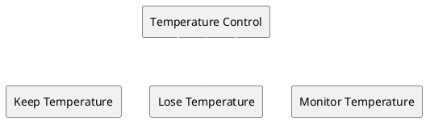
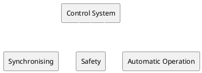

# Analysis of the Process

The process consists of controlling the output of a thermoplastic material extruder to produce sheets with a thickness ranging from 2 to 4 millimeters, a minimum width of 30 centimeters, and a continuous length or ideally cut every 40 centimeters. The final sheet must be sufficiently consolidated to ensure rigidity and smooth enough to be handled by a vacuum system.

STATE DIAGRAM:

FUNCTIONS OF THE PROCESS:

SUBFUNCTIONS FOR EACH FUNCTION:

  - CHANGE SHAPE

 - MOVE SEMI FINISHED SHEET

 - TEMPERATURE CONTROL

 - CONTROL SYSTEM

