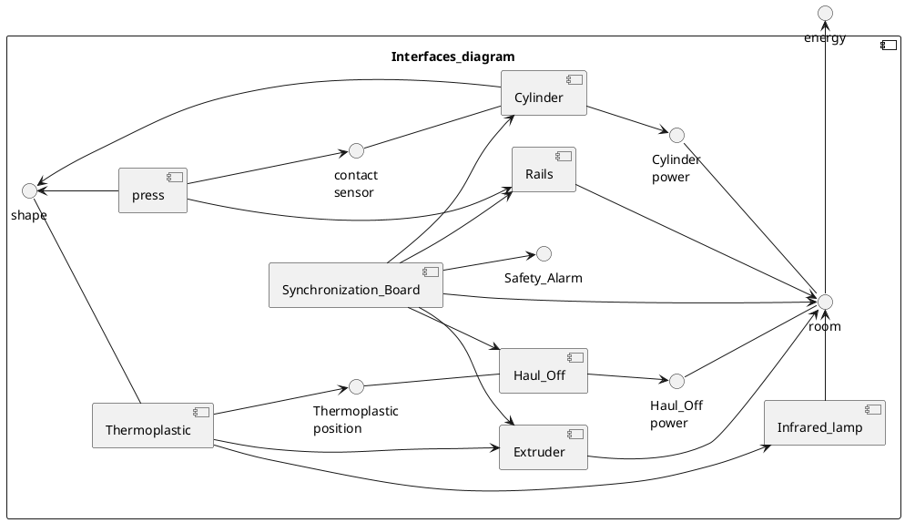

# Interfaces

```plantuml
@startuml 
skinparam backgroundColor transparent
left to right direction

component Interfaces_diagram {
    
    [Cylinder]
    () "contact\nsensor" -- Cylinder

    [Cylinder]
    () "Cylinder\npower" -- room
    () "Haul_Off\npower" -- room
   
    Cylinder --> "Cylinder\npower"
    Cylinder --> shape
    

    [Haul_Off]
    () "Thermoplastic\nposition" -- Haul_Off
    Haul_Off --> "Haul_Off\npower"
    [Thermoplastic]
    () shape -- Thermoplastic
    
    [press]
    press -l-> shape

    Thermoplastic --> "Thermoplastic\nposition"
    press --> "contact\nsensor"

    [Infrared_lamp]
    Infrared_lamp -> room
    Thermoplastic -->Infrared_lamp
    
    [Extruder]
    Extruder --> room
    Thermoplastic --> Extruder
     
    [Rails]
    Rails --> room
    press --> Rails

    [Synchronization_Board]
    Synchronization_Board --> Rails
    Synchronization_Board --> Cylinder
    Synchronization_Board --> Haul_Off
    Synchronization_Board --> Extruder
    Synchronization_Board --> room
    Synchronization_Board --> Safety_Alarm
 

}
room -r-> energy

@enduml
```

This diagram shows how each component of the system influences other components. With the sychronization board as central part in our design.